# ToDoList
Node.js Learning Journey

###############################################################################

Projeyi Çalıştırma
Projeyi yerel makinenizde çalıştırmak için aşağıdaki adımları takip edin:

1. Backend'i Başlatın
Sunucuyu ayağa kaldırmak için terminalde şu komutları çalıştırın:

cd backend
node server.js

2. Frontend'i Başlatın
Yeni bir terminal sekmesi açın ve arayüzü başlatmak için şu komutları çalıştırın:

cd frontend
npm run dev

###############################################################################

This project is my first step into Node.js and full-stack development.

I built a real-time To-Do List application to learn:
+ Node.js & Express.js
+ MongoDB & Mongoose
+ JWT Authentication
+ Role-based authorization
+ REST API structure
+ React frontend integration
+ Socket.IO for real-time updates
+ Understanding CRUD operations deeply
+ Managing state between frontend and backend
+ Real-world authorization scenarios
+ Multi-user project management
+ Backend data relationships and access control

The main goal of this project is learning by building and understanding
how backend and frontend communicate in a real application.

Features:
+ User registration and login
+ JWT based authentication
+ Protected routes
+ Project based To-Do lists
+ Real-time updates between users
+ Role and permission management
+ Creating projects for organizing tasks
+ Adding To-Do items under specific projects
+ Linking projects and tasks to authenticated users
+ Backend API endpoints for project and todo management
+ Frontend dashboard for listing and selecting projects
+ Synchronization between frontend and backend using REST APIs
+ Implemented full Project CRUD architecture (Create, Read, Update, Delete)
+ Implemented full To Do CRUD architecture (Create, Read, Update, Delete)
+ Added ability to invite/add participants to projects
+ Participants have limited access based on role
+ Improved data modeling between Projects, Users, and To-Do items
+ Strengthened authorization logic to ensure secure access to project resources
+ Added states (Planing - Ongoing - Done)

###############################################################################

+ Kayıt Ekranı (Koyu Tema)
 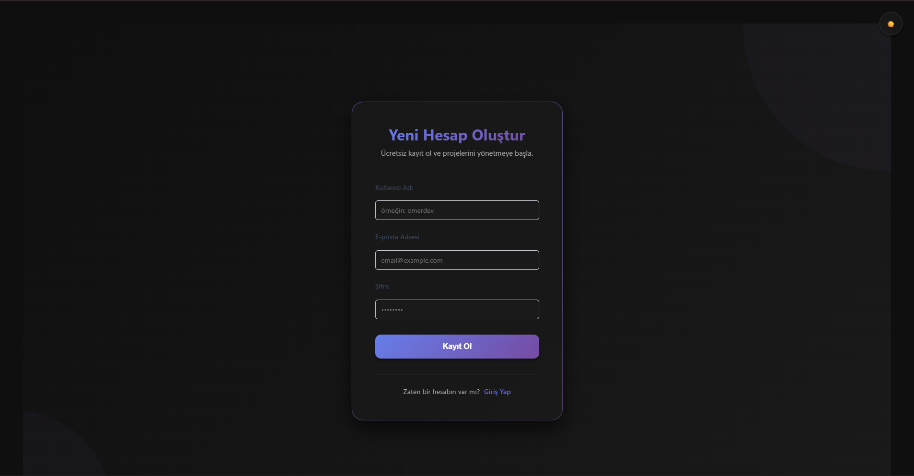

+ Giriş Ekranı (Açık Tema)
 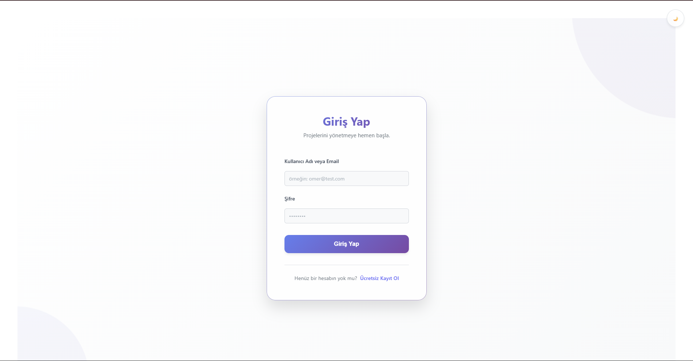

+ Gösterge Paneli (Açık Tema)
 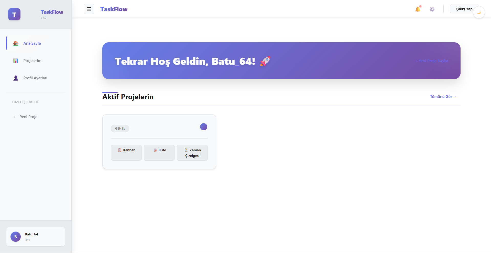

+ Gösterge Paneli (Koyu Tema)
 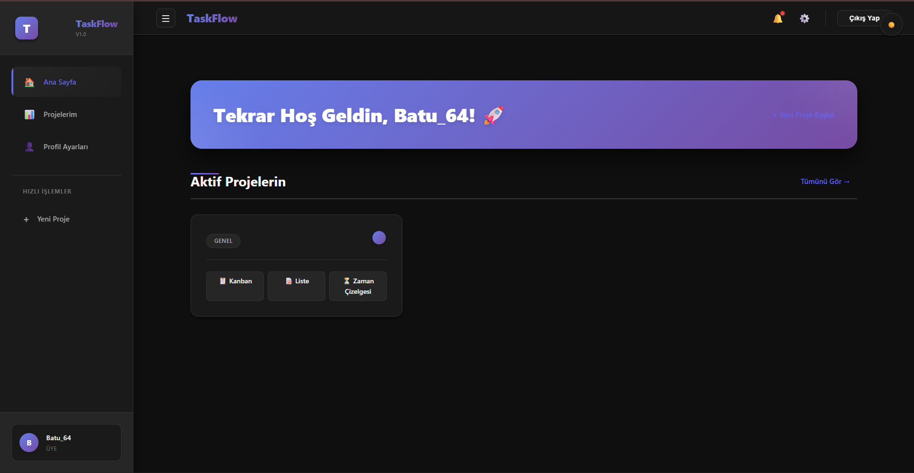

+ Projeler
 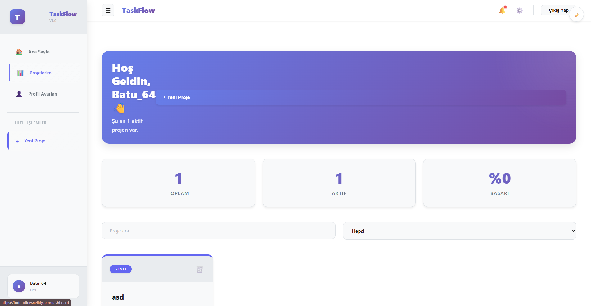

+ Kanban Çizelgesi
 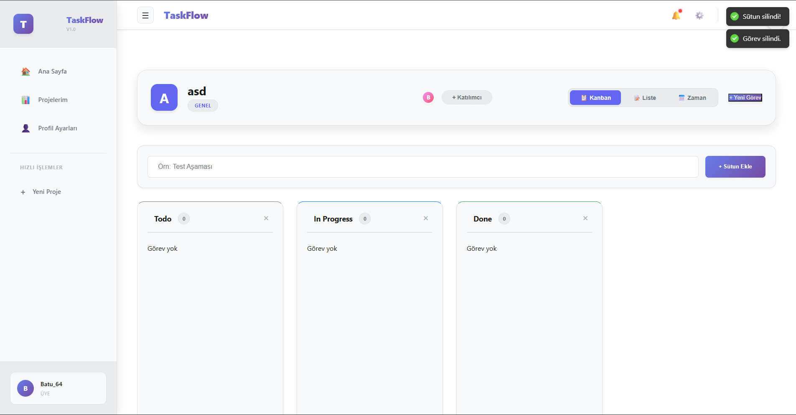

+ Proje Oluşturma
 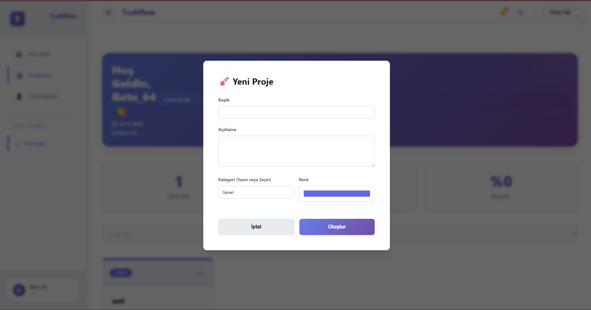

+ To Do Oluşturma
 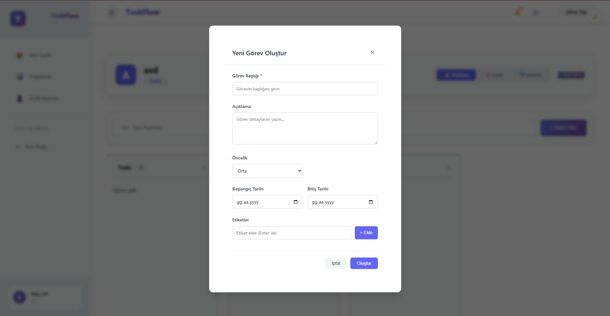

+ To Do Listeleme
 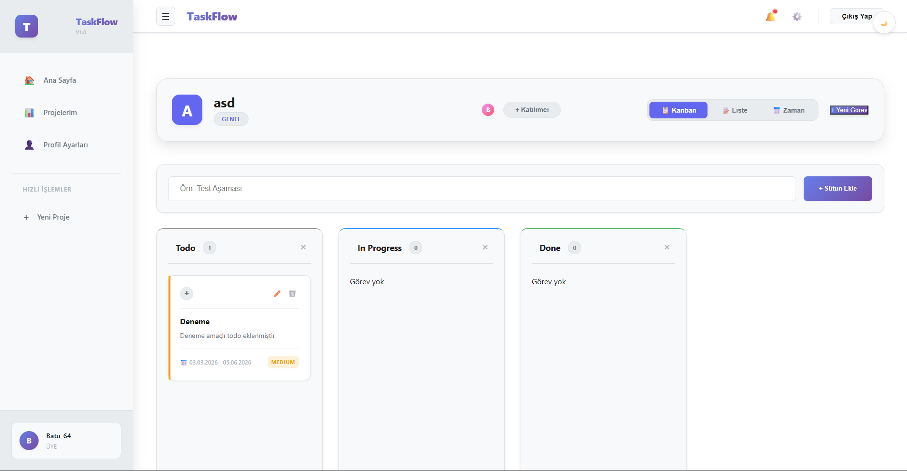

+ Durum Oluşturma
 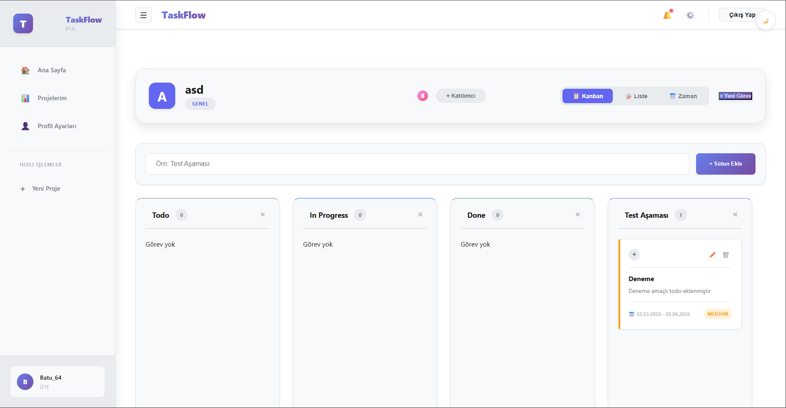

+ To Do Güncelleme
 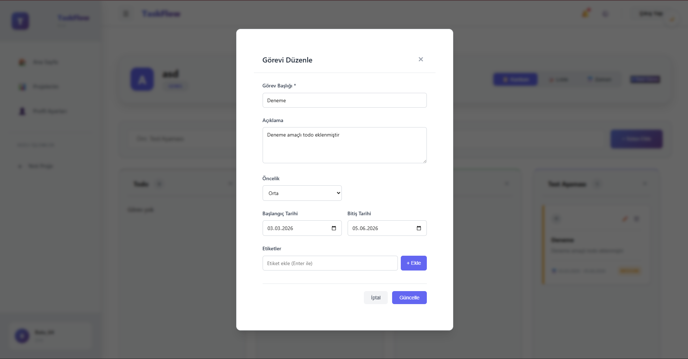

+ Sürüklenebilir To Do
 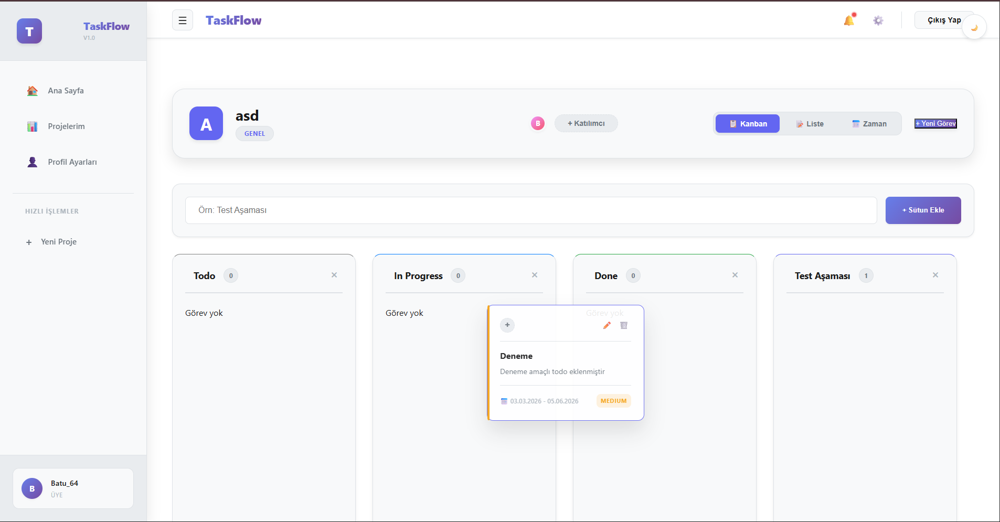

+ Liste Çizelgesi
 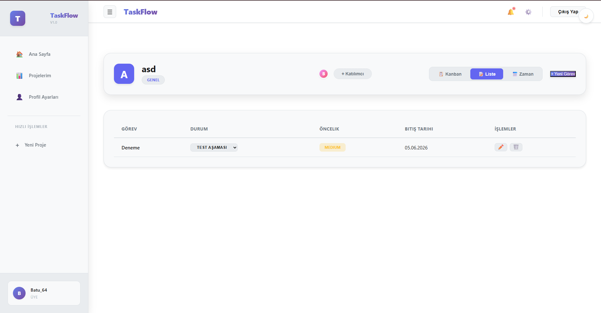

+ Zaman Çizelgesi
 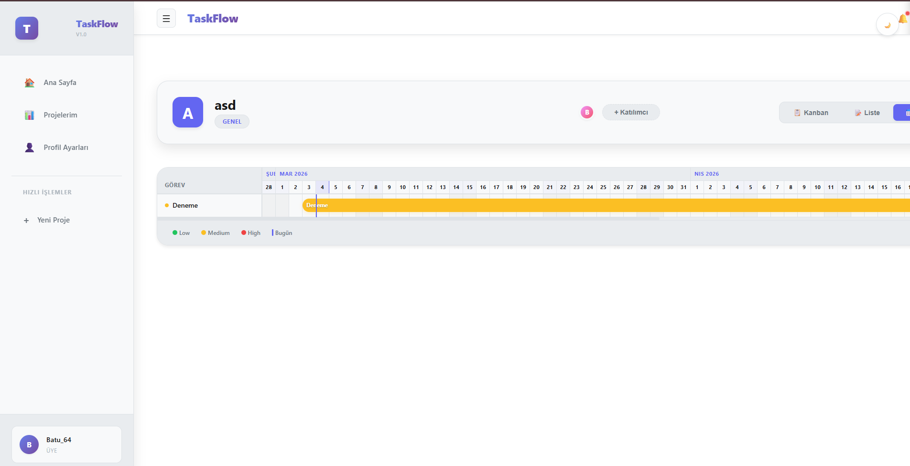

 ###############################################################################